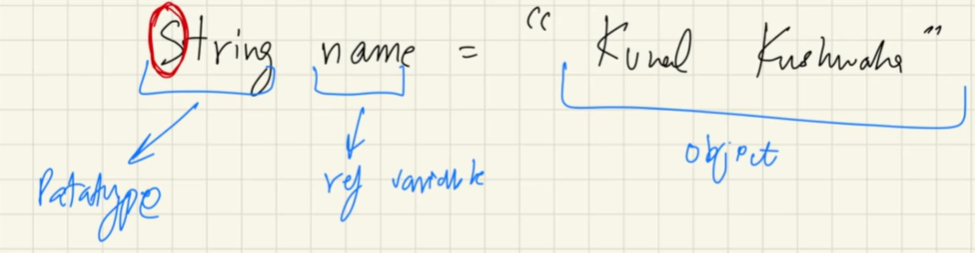

### Strings

* A string is a ==**sequence of characters**==. 
* Strings are one of the most commonly used data types in Java and are represented by the ==**String class in the java.lang package.**==
* A string in Java is ==**immutable**==, meaning once it is created, its content cannot be changed.


### **Note**
Consider the below code!
```java
    String a = "JD";
    String b = "JD";
```
Both a,b are stored in stack and the String Objects are stored in heap!
does above code ==**makes a,b point to same obj or diff identical objects??**==

### Concepts
### 1. **String Pool**
  * A seperate memory or structure inside heap.
  * **Speciality** : similar string objs are not created! ==**UNIQUE OBJ ONLY**==
  * So from the above ex inside note, both a,b points to same single instance of OBJ "JD" inside string pool.
  * ==**Makes code optimal.**==
  * Srings are immutable due to some security reasons.
  
    ```java
    String a = "JD";
    System.out.println(a);
    a = "iamjayandhan";
    System.out.println(a);
    ```

    This results:
    ```console
    JD
    iamjayandhan
    ```
  * Here reference variable is **made to point newly created obj** "**iamjayandhan**". Now the object "**JD**" has **no ref var** pointing! This obj **"JD" now will be garbage collected.**
  * ==**IF WE MODIFY, WE ACTUALLY CREATE NEW STRING OBJ EVERYTIME!**==
  * first it will check pool, if it is already there then it will reuse. Else it will create a new obj.

### Why we cant modify string objects?
ex : consider 5 persons a,b,c,d,e has same name "JD"

**a,b,c,d,e -> "JD"**

if one person changes his same, all others name will also gets changed!
so for this reason, java security concerns over strings and behaves like this.

now one person "a" changes his name to "jimmy", now:
**a -> "jimmy"**
**b,c,d,e -> "JD"**

**Thus SECURE😇**

### How to create duplicate objects that has same value?
```java
  String c = new String("JD");
  String d = new String("JD");
```
This way, obj are created outside the string pool.
Thus duplicates are allowed! They will be inside heap, outside pool.


### String Comparisons
1. **== method (Comparator):**
   * Checks if ref vars are pointing to same obj.
2. **.equals():**
   * checks only the values, not ref.
  

### Memery mgmt and garbage collection
src: [Java Memory Management and Garbage Collection in Depth](https://www.youtube.com/watch?v=vz6vSZRuS2M) 
goto : MM&GC folder

### PrintStream Class (Output)
Everytime we use println(), the following process occurs to print that int value in console as string.

### 1. Integer

```java
  System.out.println(48);
```

java.base\java.io\PrintStream.class
```java
  /**
   * Prints an integer and then terminate the line.  This method behaves as
   * though it invokes {@link #print(int)} and then
   * {@link #println()}.
   *
   * @param x  The {@code int} to be printed.
   */
  public void println(int x) {
      synchronized (this) {
          print(x);
          newLine();
      }
  }
```

java.base\java.io\PrintStream.class
```java
  /**
   * Prints an integer.  The string produced by {@link
   * java.lang.String#valueOf(int)} is translated into bytes
   * according to the platform's default character encoding, and these bytes
   * are written in exactly the manner of the
   * {@link #write(int)} method.
   *
   * @param      i   The {@code int} to be printed
   * @see        java.lang.Integer#toString(int)
   */
  public void print(int i) {
      write(String.valueOf(i));
  }
```

java.base\java.lang\String.class
```java
  /**
   * Returns the string representation of the {@code int} argument.
   * <p>
   * The representation is exactly the one returned by the
   * {@code Integer.toString} method of one argument.
   *
   * @param   i   an {@code int}.
   * @return  a string representation of the {@code int} argument.
   * @see     java.lang.Integer#toString(int, int)
   */
  public static String valueOf(int i) {
      return Integer.toString(i);
  }
```

java.base\java.lang\Integer.class
```java
  /**
   * Returns a {@code String} object representing the
   * specified integer. The argument is converted to signed decimal
   * representation and returned as a string, exactly as if the
   * argument and radix 10 were given as arguments to the {@link
   * #toString(int, int)} method.
   *
   * @param   i   an integer to be converted.
   * @return  a string representation of the argument in base&nbsp;10.
   */
  @HotSpotIntrinsicCandidate
  public static String toString(int i) {
      int size = stringSize(i);
      if (COMPACT_STRINGS) {
          byte[] buf = new byte[size];
          getChars(i, size, buf);
          return new String(buf, LATIN1);
      } else {
          byte[] buf = new byte[size * 2];
          StringUTF16.getChars(i, size, buf);
          return new String(buf, UTF16);
      }
  }
```
==**Conversion Flow:**== **println(int)** → **print(int)** → **String.valueOf(int)** → **Integer.toString(int).**

### 2. Object

```java
  System.out.println(new int[]{1,2,3,4,5});
```

java.base\java.io\PrintStream.class
```java
  /**
   * Prints an Object and then terminate the line.  This method calls
   * at first String.valueOf(x) to get the printed object's string value,
   * then behaves as
   * though it invokes {@link #print(String)} and then
   * {@link #println()}.
   *
   * @param x  The {@code Object} to be printed.
   */
  public void println(Object x) {
      String s = String.valueOf(x);
      synchronized (this) {
          print(s);
          newLine();
      }
  }
```

java.base\java.io\PrintStream.class
```java
  /**
   * Prints a string.  If the argument is {@code null} then the string
   * {@code "null"} is printed.  Otherwise, the string's characters are
   * converted into bytes according to the platform's default character
   * encoding, and these bytes are written in exactly the manner of the
   * {@link #write(int)} method.
   *
   * @param      s   The {@code String} to be printed
   */
  public void print(String s) {
      write(String.valueOf(s));
  }
```

java.base\java.lang\String.class
```java
  /**
   * Returns the string representation of the {@code Object} argument.
   *
   * @param   obj   an {@code Object}.
   * @return  if the argument is {@code null}, then a string equal to
   *          {@code "null"}; otherwise, the value of
   *          {@code obj.toString()} is returned.
   * @see     java.lang.Object#toString()
   */
  public static String valueOf(Object obj) {
      return (obj == null) ? "null" : obj.toString();
  }
```

java.base\java.lang\Object.class
```java
  /**
   * Returns a string representation of the object. In general, the
   * {@code toString} method returns a string that
   * "textually represents" this object. The result should
   * be a concise but informative representation that is easy for a
   * person to read.
   * It is recommended that all subclasses override this method.
   * <p>
   * The {@code toString} method for class {@code Object}
   * returns a string consisting of the name of the class of which the
   * object is an instance, the at-sign character `{@code @}', and
   * the unsigned hexadecimal representation of the hash code of the
   * object. In other words, this method returns a string equal to the
   * value of:
   * <blockquote>
   * <pre>
   * getClass().getName() + '@' + Integer.toHexString(hashCode())
   * </pre></blockquote>
   *
   * @return  a string representation of the object.
   */
  public String toString() {
      return getClass().getName() + "@" + Integer.toHexString(hashCode());
  }
```

```java
  [I@2401f4c3
  //here '[' - represents 1D array
  // 'I' - Integer Array
  // '@' - seperator
  // '2401f4c3' - computed hash code for obj
```

==**Conversion Flow:**== **println(Object)** → **String.valueOf(Object)** → **obj.toString()** → **Object.toString().**

Override default Object's toString()?
Yes with the help of Arrays class
```java
  import java.util.Arrays;
  System.out.println(Arrays.toString(new int[]{1,2,3,4,5})); //uses StringBuilder!
```

Implementation
```java
  /**
   * Returns a string representation of the contents of the specified array.
   * The string representation consists of a list of the array's elements,
   * enclosed in square brackets ({@code "[]"}).  Adjacent elements are
   * separated by the characters {@code ", "} (a comma followed by a
   * space).  Elements are converted to strings as by
   * {@code String.valueOf(int)}.  Returns {@code "null"} if {@code a} is
   * {@code null}.
   *
   * @param a the array whose string representation to return
   * @return a string representation of {@code a}
   * @since 1.5
   */
  public static String toString(int[] a) {
      if (a == null)
          return "null";
      int iMax = a.length - 1;
      if (iMax == -1)
          return "[]";

      StringBuilder b = new StringBuilder();
      b.append('[');
      for (int i = 0; ; i++) {
          b.append(a[i]);
          if (i == iMax)
              return b.append(']').toString();
          b.append(", ");
      }
  }
```
```java
  //Result
  [1,2,3,4,5]
```


### Wrapper & Strings are also objects!
so both are also objects right? then why hashval is not printed in that case? TRUTH: Default 'toString()' of Object is overridden by 'toString()'
method present in String class and Integer class! Look below example:
### When a string is passed?
```java
  //Strings are objects
  System.out.println("JD"); //JD , not hashval!
```
toString gets overridden by this:
```java
  /**
   * This object (which is already a string!) is itself returned.
   *
   * @return  the string itself.
   */
  public String toString() {
      return this;
  }
```

### When a Integer passed?
```java
  //Wrappers are Objects
  Integer a = 48;
  System.out.println(a); //48, not that hashval!
```
toString default obj function is overridden by this:
```java
  public String toString() {
    return Integer.toString(value);
  }
```

### Note
1. Primitives are stored in stack memory.
2. Objects are stored in heap.

### String concatenation in java
**Plus (+)**
   * can only be used with primitives, or if anyone is them is string.
   * obj+obj wont work, but obj+""+obj works => makes it a complete string.
   * operator overloading is **not supported** in java(results in poor code.)
   * ==**Only operator that is overloading is + in java. To support string concatenation.**==

### String Performance
```java
  String series = "";
  //code creates 25 obj and 26th obj is returned, others are garbage collected.
  //not efficient code as strings are immutable
  //memory wastage occurs. so many dereferences.

  //1+2+3.....N
  //N(N+1)/2 => O(N^2) complexity!
  for(int i=0;i<26;i++){
      series += (char)('a'+i);
  }

  System.out.println(series);
```

==**What if there is a way to modify strings? any wrapper?**==

### StringBuilder Class
Only one object is made and changes are applied in that obj only.
```java
  StringBuilder series2 = new StringBuilder(); //Obj
  for(int i=0;i<26;i++){
      series2.append((char)('a'+i)); //changes are made on one obj only. New are not created everytime!
  }
  System.out.println(series2);
```

