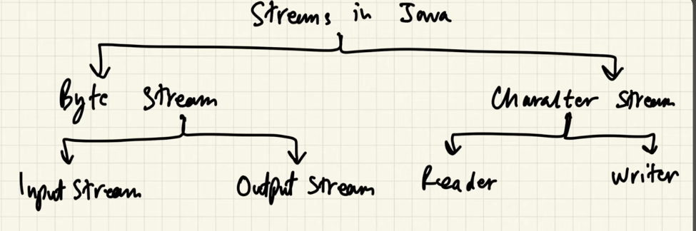

### Streams

1. Streams in Java are used for handling input and output (I/O) operations.
2. They provide a continuous flow of data (either in bytes or characters) between the program and a physical device (file, network, console, etc.).
3. Java abstracts these streams and provides built-in classes in the java.io package.
4. Streams do not store data; they only transfer it.
5. Java categorizes streams based on data type and direction (input/output).



### Types of Streams in Java I/O
1. Byte Stream 
2. Character Stream

Both extends Object class(Normal stuff)
Each contains 2 classes. so totally 4 abstract classes!
Most important methods to implement: Read(), Write()

1. InputStream: https://docs.oracle.com/javase/8/docs/api/java/io/InputStream.html
2. OutputStream: https://docs.oracle.com/javase/8/docs/api/java/io/OutputStream.html

### Byte Stream (For Binary Data)
1. Used for **handling binary files** (e.g., images, audio, video). eg. pdf,txt file etc.
2. Works with raw bytes.

**Key classes:** 
1. **InputStream** - To read byte data
2. **OutputStream** - To write byte data 
   
Example:
```java
FileInputStream fis = new FileInputStream("file.txt");
int data = fis.read();  // Reads one byte at a time
fis.close();
```

### Note:
Any class name that ends with 'InputStream or OutputStream', then it is for Byte data.
Any class name that ends with 'Reader or Writer' then it is for Character data.
Any class that implements AutoClosable, we can consider that class as a Resource! Resource needs to be closed after use! 

### 2. Character Streams (For Text Data)
1. Used for handling text files.
2. Works with **Unicode characters** instead of raw bytes. eg. Hindi,Chinese.
3. More efficient than Byte stream.
   
**Key classes:**
1. **Reader**
2. **Writer**

Example:
```java
FileReader fr = new FileReader("file.txt");
int data = fr.read();  // Reads one character at a time
fr.close();
```

### Predefined Streams
Java provides three predefined streams in the System class, but the **two most commonly used** ones are:

1. System.in (Standard Input Stream)
* Used to take input from the **keyboard**(default).
* It is a **InputStream** type (byte stream).
* Commonly used with Scanner or BufferedReader.

Example:
```java
import java.util.Scanner;
public class Main {
    public static void main(String[] args) {
        Scanner scanner = new Scanner(System.in);
        System.out.print("Enter your name: ");
        String name = scanner.nextLine(); // Reads input from System.in
        System.out.println("Hello, " + name);
        scanner.close();
    }
}
```

2. System.out (Standard Output Stream)
* Used to display output on the console.
* It is a **PrintStream** type (character stream).
* Commonly used with print(), println(), and printf().
* Unlike InputStream , OutputStream (belongs to byte stream), we have PrintStream (common for both Byte and Character stream!)

### But It Extends OutputStream (Byte Stream)?
**Yes! PrintStream technically extends OutputStream (which is a byte stream).** However, because it **internally** handles character encoding and prints text in a readable format, it **behaves more like a character stream.**

Example:
```java
public class Main {
    public static void main(String[] args) {
        System.out.println("Hello, Java!"); // Prints to console
    }
}
```

1. System.err (Standard Error Stream)
* Used to display error messages separately from normal output.
* Also a PrintStream.
* Often used for debugging.

Example:
* consider Input.java file!
* Run "java .\Input.java > Input.txt"
* now it reads number, then sysout will be there inside file but that syserr will not be there, but displayed in console!

### Common Mistake: Confusing I/O Streams with Java Streams API
1. **Java I/O Streams (java.io)** – Handles file input/output (reading/writing files, network data, etc.).

2. **Java Streams API (java.util.stream)** – Handles processing collections (like filtering, mapping, reducing data, etc.).