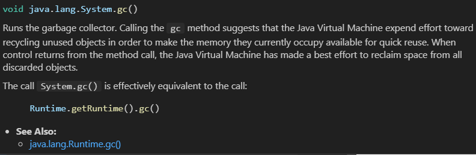
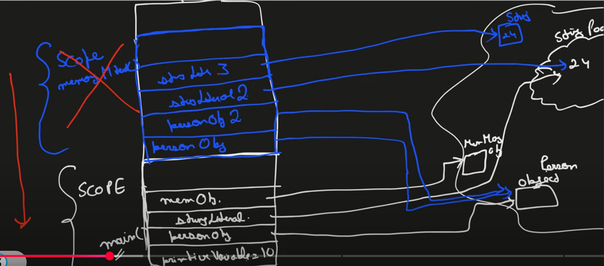
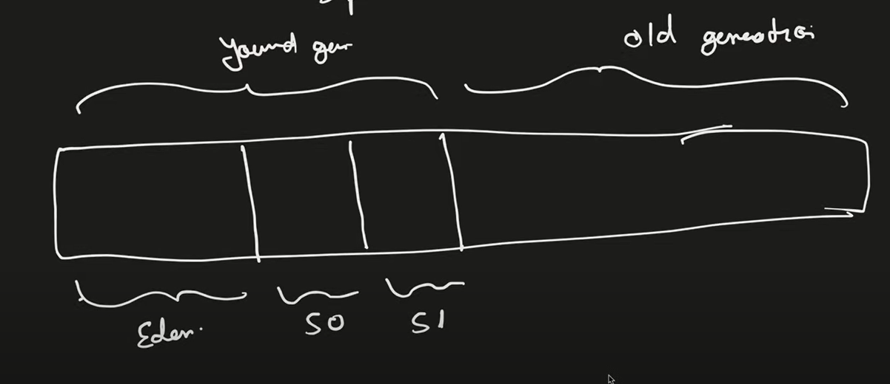

### Memory Management and Garbage Collection
Java's memory management automates the allocation and deallocation of memory, ensuring efficient resource utilization. Garbage collection eliminates the risk of memory leaks by reclaiming memory from objects no longer in use.

src: [Java Memory Management and Garbage Collection in Depth](https://www.youtube.com/watch?v=vz6vSZRuS2M)

**There are two types of memory(RAM):**
1. Stack
2. Heap

* Both Stack and Heap are created by **JVM and Stored in RAM.**
* In general, there will be **multiple stacks and one heap.**
* **Heap** will have **more memory than that of stack.**

### **Stack Memory part**
- Store ==**Temporary variables, including local variables and method parameters.**==
- Store **Primitive data types**
- Store Reference of the heap objects
  * Strong reference
  * Weak reference
  * Soft reference
- ==**Each thread has its own Stack memory.**==
- Variables within a SCOPE is only visible and as soon as any variable goes out of the SCOPE, it ==**get deleted from the Stack (in LIFO order)**==
- When Stack memory goes full, its throws ==**"java.lang.StackOverflowError"**==

### **Heap Memory Part**
- **Store Objects.**
- There is no order of allocating the memory.
- ==**Garbage Collector is used to delete the unreferenced objects from the heap.**==
- Garbage collector runs periodically and managed by JVM.
- ==**Cmd : System.gc()**==, ==**Even if we use this cmd, there is no gaurantee! All depends on JVM. That is why java follows Automatic memory management.**==
- When heap gets full frequently, then gc also runs frequently...else runs at normal rate.
  
  * **Mark and Sweep Algorithm**
    The garbage collector identifies unreachable objects (Mark phase) and reclaims their memory (Sweep phase).
  * **Types of GC:**
    * Single GC
    * Parallel GC
    * CMS (concurrent Mark Sweep) 
    * G1
- ==**Heap memory is shared with all the threads.**==
- **Heap also contains the String Pool**.
- String literals are stored in a special area of Heap called the ==**String Pool, which improves memory efficiency by reusing immutable string objects.**==
- When Heap memory goes full, its throws ==**"java.lang.OutofMemoryError"**==
- Heap memory is further divided into:
  * Young Generation (minor GC happens here)
  Young Generation is for short-lived objects, while Old Generation is for long-lived objects that survive multiple GC cycles.
    * Eden
    * Survivor
  * Old/Tenured Generation (major GC happens here)
  * Permanent Generation

**Eg:**
Consider program,


### Different Types of references:
**Stack Stores Reference** of the heap objects!
1. Strong reference
   ```java
    Person pobj = new Person();
    //Person obj in heap has pobj ref var in stack.
   ```
   When gc runs, ==**it checks if Person obj in heap has any ref. Here it is, so it wont free up memory!**==
2. Weak reference
    ```java
    // java.lang.ref.WeakReference Class
    import java.lang.ref.WeakReference;
    WeakReference<Person> wobj = new WeakReference<Person>(new Person());
   ```
   When gc runs, ==**it checks if Person obj in heap has any ref. Though it has a ref var, since it is weak it will free up memory! Now the ref var will point to null!**==
3. Soft reference
    ```java
    // java.lang.ref.SoftReference Class
    import java.lang.ref.SoftReference;
    SoftReference<Person> wobj = new SoftReference<Person>(new Person());
    ```
    ==**Garbage collector is allowed to free up memory for obj only if urgent, in need of memory! until then gc wont free up memory!**==

Soft references are cleared only when memory is low, while weak references are cleared as soon as they are no longer strongly referenced.

### How to change reference?
1. **Make it null**
   ```java
   Person pobj = new Person();
   pobj = null;
    ```
2. **Point to another obj**
   ```java
   Person pobj = new Person();
   Person pobj2 = new Person();
   pobj = pobj2;
   ```

### Heap memory structure(2 parts):


1. **Young/nursery generation:**
    1. Eden
    2. S0 (Survivor space)
    3. S1 (Survivor space)
  * When we create a new obj, first it will be placed in this area "Eden".
  * Minor GC frequently checks for performing gc.
  * They increment age of obj if survived.
  * They are Marked and Sweeped between S0 & S1.
  * If age reached certain threshold, then they are sweeped into Old generation.
  * In young generation, gc is done frequently! 

2. **Old/Tenured generation:**
   * Here Major GC happens.
   * GC is dont not so frequently.
[Metaspace](https://www.geeksforgeeks.org/metaspace-in-java-8-with-examples/)

### **Non-heap (Metaspace):**
Metaspace stores class metadata, like information about **classes, methods, and their structure, needed for the JVM to execute the program.**

Metaspace is used whenever a class is loaded into memory.**It gets cleared (removed) when the class or its classloader is no longer in use,** and garbage collection reclaims the memory.

Since Metaspace is in native memory, its size depends on the available system memory unless limited using -XX:MaxMetaspaceSize.

* This is not a part of heap memory
* Stores class variables (Static vars)
* Stores class meta data
* Stores Constants (Static final)

Permanent Generation's replacement is Metaspace! Only diff is Permanent Genration lived inside heap, but this metaspace lives outside the heap.

### Garbage collector and its algorithms
1. **Mark & Sweep algorithm**
2. **Mark & Sweep with compact memory** 
After sweeping, memory compaction consolidates free space to reduce fragmentation, making memory allocation for new objects faster.

### Different Versions of GC
1. **Serial**
   * uses only one thread
   * slow   
   * gc is expensive (when running, all other application threads are paused)
2. **Parallel** -> ==**default GC**==
   * Multiple working threads (depends on number of processor cores) 
3. **Concurrent Mark and Sweep (CMS)**
   * Concurrent working of gcc threads with application threads.
   * Not always works
   * No memory compaction
4. **G1 Garbage collector**
   * Improved version of CMS gc, work is guaranteed and memory compaction is possible.