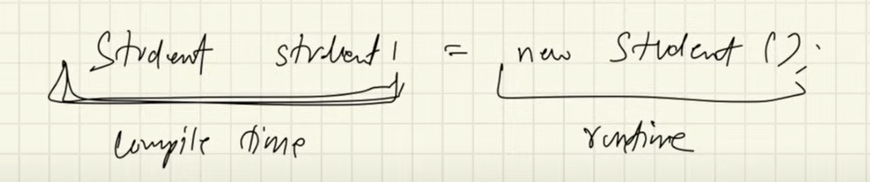
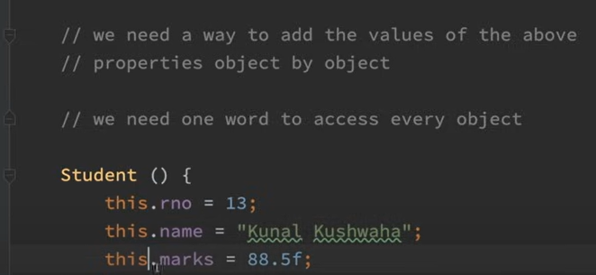
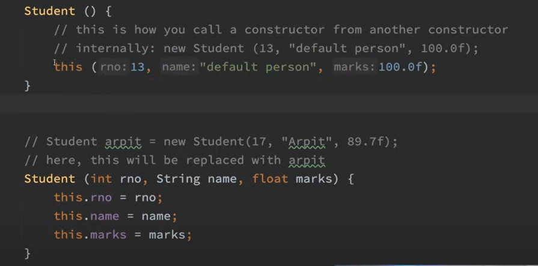
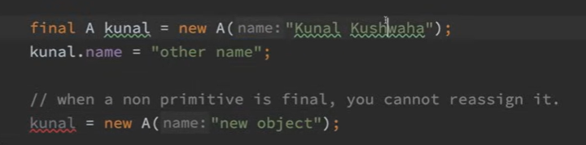
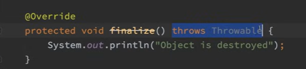

### Classes & Objects

1. **Class** => Logical construct
2. **Object** => Physical Reality & Occupies space in memory

### Three props of Object
1. **Identity**: Each object is unique
2. **State**: An object has various properties that may change
3. **Behavior**: An object can do things and can have things done to it

### Terminologies:
1. **Instance var** -> var inside Obj
   Use '.' dot operator to access these var from obj.
   

### Note!
1. ClassName refName; => we **declare a ref var**.
   **reference variable is declared but not initialized.**
2. If Obj ref var is not initialized, default value is **null.** 
   **reference variable does not point to any object in memory; it simply holds null.**
3. refName = new ClassName(); => **new will dynamically allocates memory during runtime and returns ref to it.**
   Now that refName will point to that Obj.
   a. **refName => Lives in Stack**
   b. **Obj => Lives in Heap**
4. **All classes and objects in java must be allocated in runtime!**
5. This this Fu*king guy below:

6. In Java, there is no:
   1. **Pointers**
   2. No Manual **malloc/free of memory** (Java uses Garbage Collector to do these!)
   3. Without JNI, **No direct System calls.**
   

### Default Values of Primitive Data Types

| Data Type        | Default Value | Example                                           |
|------------------|---------------|---------------------------------------------------|
| `byte`           | `0`           | `byte b;` (b will be `0` by default)              |
| `short`          | `0`           | `short s;` (s will be `0` by default)             |
| `int`            | `0`           | `int i;` (i will be `0` by default)               |
| `long`           | `0L`          | `long l;` (l will be `0L` by default)             |
| `float`          | `0.0f`        | `float f;` (f will be `0.0f` by default)          |
| `double`         | `0.0d`        | `double d;` (d will be `0.0d` by default)         |
| `char`           | `'\u0000'`    | `char c;` (c will be `'\u0000'` or null character)|
| `boolean`        | `false`       | `boolean b;` (b will be `false` by default)       |

### Default Values of Wrapper Types

| Wrapper Type     | Default Value  | Example                                           |
|------------------|----------------|---------------------------------------------------|
| `Byte`           | `null`         | `Byte b;` (b will be `null` by default)           |
| `Short`          | `null`         | `Short s;` (s will be `null` by default)          |
| `Integer`        | `null`         | `Integer i;` (i will be `null` by default)        |
| `Long`           | `null`         | `Long l;` (l will be `null` by default)           |
| `Float`          | `null`         | `Float f;` (f will be `null` by default)          |
| `Double`         | `null`         | `Double d;` (d will be `null` by default)         |
| `Character`      | `null`         | `Character c;` (c will be `null` by default)      |
| `Boolean`        | `null`         | `Boolean b;` (b will be `null` by default)        |

### Note!
1. Java first checks obj for value, if not present then it **will print default value!**
2. Jesus!
   
   **Usage of this keyword!**
   We **replace that 'this' keyword** with corresponding refName each time we create Obj with parameters in Constructor!
3. Call a constructor from another constructor!
   <!--  -->
   

### Why we dont use "new" keyword for creating primitive datatypes??
1. **Primitive dtypes are not implemented as OBJs.**
2. **OBJs are stored in HEAP.**
3. **Primitives are stored in stack memory only!**
4. In primitives, we follow **pass by value. Objects are pass by ref**.
5. Even if we try to swap 2 primitive types and 2 Wrapper types,**it WONT SWAP.**
6. Wrapper **fails because classes are declared as FINAL!**
7. 'final' -> makes it **constant.**
8. **final vars must be initialized!**
9.  
   **This makes refName point to same obj(We can modify values of that OBJ).
   But cannot reassign that refName to another new OBJ**!
10. In Java, Garbage collection is done automatically.
   User is not allowed to destory any obj but allowed to perform
   some actions while destroying OBJ! We use finalizer called finalize method!
   When an OBJ is about to get destroyed, code inside this block gets executed!
   Java calls this method during Garbage collection process...
   

