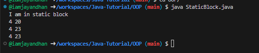

### Classes & Objects

1. **Class** => Logical construct
2. **Object** => Physical Reality & Occupies space in memory

### Three props of Object
1. **Identity**: Each object is unique
2. **State**: An object has various properties that may change
3. **Behavior**: An object can do things and can have things done to it

### Terminologies:
1. **Instance var** -> var inside Obj
   Use '.' dot operator to access these var from obj.
   

### Note!
1. ClassName refName; => we **declare a ref var**.
   **reference variable is declared but not initialized.**
2. If Obj ref var is not initialized, default value is **null.** 
   **reference variable does not point to any object in memory; it simply holds null.**
3. refName = new ClassName(); => **new will dynamically allocates memory during runtime and returns ref to it.**
   Now that refName will point to that Obj.
   a. **refName => Lives in Stack**
   b. **Obj => Lives in Heap**
4. **All classes and objects in java must be allocated in runtime!**
5. This this Fu*king guy below:

6. In Java, there is no:
   1. **Pointers**
   2. No Manual **malloc/free of memory** (Java uses Garbage Collector to do these!)
   3. Without JNI, **No direct System calls.**
   

### Default Values of Primitive Data Types

| Data Type        | Default Value | Example                                           |
|------------------|---------------|---------------------------------------------------|
| `byte`           | `0`           | `byte b;` (b will be `0` by default)              |
| `short`          | `0`           | `short s;` (s will be `0` by default)             |
| `int`            | `0`           | `int i;` (i will be `0` by default)               |
| `long`           | `0L`          | `long l;` (l will be `0L` by default)             |
| `float`          | `0.0f`        | `float f;` (f will be `0.0f` by default)          |
| `double`         | `0.0d`        | `double d;` (d will be `0.0d` by default)         |
| `char`           | `'\u0000'`    | `char c;` (c will be `'\u0000'` or null character)|
| `boolean`        | `false`       | `boolean b;` (b will be `false` by default)       |

### Default Values of Wrapper Types

| Wrapper Type     | Default Value  | Example                                           |
|------------------|----------------|---------------------------------------------------|
| `Byte`           | `null`         | `Byte b;` (b will be `null` by default)           |
| `Short`          | `null`         | `Short s;` (s will be `null` by default)          |
| `Integer`        | `null`         | `Integer i;` (i will be `null` by default)        |
| `Long`           | `null`         | `Long l;` (l will be `null` by default)           |
| `Float`          | `null`         | `Float f;` (f will be `null` by default)          |
| `Double`         | `null`         | `Double d;` (d will be `null` by default)         |
| `Character`      | `null`         | `Character c;` (c will be `null` by default)      |
| `Boolean`        | `null`         | `Boolean b;` (b will be `null` by default)        |

### Note!
1. Java first checks obj for value, if not present then it **will print default value!**
2. Jesus!
   
   **Usage of this keyword!**
   We **replace that 'this' keyword** with corresponding refName each time we create Obj with parameters in Constructor!
3. Call a constructor from another constructor!
   <!--  -->
   

### Why we dont use "new" keyword for creating primitive datatypes??
1. **Primitive dtypes are not implemented as OBJs.**
2. **OBJs are stored in HEAP.**
3. **Primitives are stored in stack memory only!**
4. In primitives, we follow **pass by value. Objects are pass by ref**.
5. Even if we try to swap 2 primitive types and 2 Wrapper types,**it WONT SWAP.**
6. Wrapper **fails because classes are declared as FINAL!**
7. 'final' -> makes it **constant.**
8. **final vars must be initialized!**
9.  
   **This makes refName point to same obj(We can modify values of that OBJ).
   But cannot reassign that refName to another new OBJ**!
10. In Java, Garbage collection is done automatically.
   User is not allowed to destory any obj but allowed to perform
   some actions while destroying OBJ! We use finalizer called finalize method!
   When an OBJ is about to get destroyed, code inside this block gets executed!
   Java calls this method during Garbage collection process...
   

### Packages
- Packages are like containers for classes.
- Keep class names in compartment wise!
- Packages are just folders

### Static variable
- Not a part of any Obj!
- static vars should use Class name instead of this keyword (Since they r not part of any instance!)
- both this.static_var & Class_name.static_var works!
- this.static_var => first checks obj, due to absence then it checks class! Now current value of static var is used.
- Class_name.static_var => directly checks class var and uses it. (Best practice)!
- Thus, All instances of the class share the same static variable.

### How it works?
### Access via Object Reference (this.static_var or refVar.static_var):

- When you access a static variable using a reference variable (e.g., this.static_var or refVar.static_var):
**The compiler does not associate the variable with the object.** Instead, **it resolves the variable in the class scope.**
- Even though you're using an object reference, **it behaves as if you're accessing it directly through the class name** (ClassName.static_var).

### Direct Access via Class Name (ClassName.static_var):
- This is the **preferred practice** because it avoids confusion, making it clear that the variable belongs to the class, not to any instance.
- You dont even want to create Obj to access any static vars. Just use className.staticVar
- ***That is why main() is always static.! Since it is the entry point.***

### Note! (Check StaticExample.java)
- Cannot make a static reference to the non-static method greeting() from the type StaticExample
- A static method can access only static data.
- 
- Its like, Which instance of greeting u r talking about?
- also static methods cannot use 'this' keyword which belongs to instances.

### Initialize Static variables
- A Static block gets executed exactly once when class is called.
- Inside it, we can declare all static members and methods.
- The **static block is not executed during the compilation phase**; it's stored as part of the class and **will be executed later when the class is loaded into memory by the JVM.**
- **Static blocks are executed only once when the class is loaded into memory**. This is part of the class initialization phase.
- Since your class StaticBlock contains a static block, it is **executed automatically** when the class is loaded by the JVM,**before any method (including main()) is called.**

### Hence
- **Key Point**: The static block runs only once per class load, and it's used to perform initialization tasks for static variables or perform other setup operations.
- After the static block has been executed, the main method is executed next.
- The JVM **may use garbage collection to clean up memory, but in this case,** since we only have static variables and no object creation, the garbage collector **will not be involved** during the execution.
- Static block is executed for the first time when a class is loader(obj is created for the first time!)
- 

### Inner Classes
- Outer class cannot be a static!
- Static elements in Java are not fully resolved at compile time but are rather prepared and initialized during the runtime class loading phase.
- Static variables and the static block are recorded in the .class file as part of the bytecode.
- The compiler generates metadata and instructions for:
- Declaring static variables.
- Defining the static block's logic.
- Recording how static variables should be accessed.
- The **compiler does not execute the static block** or initialize static variables; it only prepares the blueprint.

### Singleton Class
- Only one obj can be created!
- We dont allow user to call constructor of that class!
- logic: Constructor is responsible to instantiate obj.
- We make constructor private!