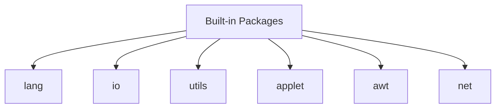

### Access Control
Access control in Java is a ==**mechanism used to restrict access**== to classes, methods, and variables. It ensures that sensitive data is protected and that code follows a defined structure for accessing class members.

### Access Modifiers
Java provides **access modifiers to define access control** for **class members (fields, methods, constructors) and classes.** There are four levels of access control in Java:

1. **private**
   * Accessible **only within the same class.**
   * Used for data hiding.

2. **default (no keyword)**
   * The variable is **accessible only within the same package.**
   * It is accessible only within the same package, and not from classes in other packages, even if they are in the same project.
   * Also known as "package-private" access.

3. **protected**
   * Accessible within the same package and by subclasses (even if in different packages).
   * protected is more restrictive than public but allows access by subclasses in different packages, unlike default (package-private) access, which does not allow access outside the package.
   * The **protected modifier is specifically designed to facilitate controlled inheritance,**==

4. **public**
   * Accessible from **anywhere** in the program.
   * Anywhere (diff packages)

### Example
```java
package mypackage;

public class Example {
    private int privateVar = 10;   // Private access
    int defaultVar = 20;          // Default access
    protected int protectedVar = 30; // Protected access
    public int publicVar = 40;    // Public access

    public void printVars() {
        // Access all variables within the same class
        System.out.println("Private: " + privateVar);
        System.out.println("Default: " + defaultVar);
        System.out.println("Protected: " + protectedVar);
        System.out.println("Public: " + publicVar);
    }
}
```
* In another class within the same package:
```java
package mypackage;

public class AccessTest {
    public static void main(String[] args) {
        Example example = new Example();
        // System.out.println(example.privateVar); // Error: private access
        System.out.println(example.defaultVar);    // Accessible
        System.out.println(example.protectedVar);  // Accessible
        System.out.println(example.publicVar);     // Accessible
    }
}
```
* In another package (with subclass):
```java
package anotherpackage;
import mypackage.Example;

public class SubclassExample extends Example {
    public void accessTest() {
        // System.out.println(privateVar); // Error: private access
        // System.out.println(defaultVar); // Error: package-private access
        System.out.println(protectedVar);  // Accessible through inheritance
        System.out.println(publicVar);     // Accessible
    }
}
```

**Note**: Check package1, package2 examples!

### Pro tip
Inheritance allows access to protected members like proVar in a subclass (Class4), but **only when the object is of the subclass type. So, you can't** use the parent class (Class1) object to access proVar directly from Class1 in another package.

### Conclusion


## Packages Types
### 1. **User defined**
  * User defined packages like we seen before!

### 2. **In-built**
  * In-built packages are **automatically imported**!
  * Types are listed below!



### Pro tip
  * The root of the class hierarchy is 'Object' class.
  * Top most class on inheritance.
  * Every class in java internally inherits Object class.
Check **ObjectDemo.java for more information**