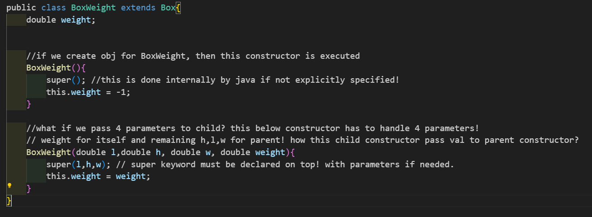
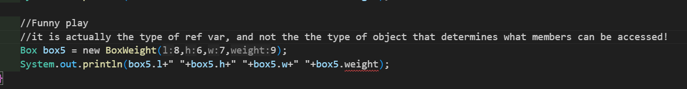

### Properties of OOP:
1. **Inheritance**
2. **Polymorphism**
3. **Encapsulation**
4. **Abstraction**

### Inheritance
- Child class ==inherits properties and methods from parent== class (base class).
- =='**extends**'== keyword is used.
- class child_class **extends** parent_class {}
- **child class** = **properties & methods from parent class** **+** **its own resources.**
- When we create obj for a child class which extends parent class, ==Internally child class constructor implicitly calls 'super()' inside to call parent class constructor!==
- This mechanism ensures ==that the parent class (Box) is fully initialized before the child class== (BoxWeight) starts its own initialization process.
- This behavior is ==crucial for maintaining a proper inheritance hierarchy==, where the base class is always initialized first.
- 
- ==**super()**== => calls parent class constructor!

### Core Note!!!
- 
- Parent referencing a child! here we cant access weight? why? **Reason below!**
- When a ref var to sub class obj is assigned to a super class ref var, you will only access things in super obj!
- Ref var dont know that child class's weight parameter!
- PROBLEM HERE IS WHEN THINGS NOT INITIALIZED!

### Things to be noted!
1. ```java
    //only parent no issues!
    //parent gets memory
    //ACCESS PARENT CLASS VARS
    Box box = new Box();
    ```

2.  ```java
    //only child no issues!
    //child gets memory and using super(), parent also gets memory.
    //ACCESS BOTH CLASS VARS
    BoxWeight box = new BoxWeight();
    ```

3.  ```java
    //parent referencing child!
    //Both gets memory, but ref since ref var is of parent type, we can only access parent class vars not the child's vars!
    //This is called upcasting. You cannot directly access the BoxWeight-specific members (like weight) without casting.
    Box box = new BoxWeight();
    ```

4.  ```java
    //child referencing parent?
    //A parent (Box) cannot be treated as a child (BoxWeight), as the parent lacks the additional members or behaviors of the child.
    //Compilation Error: "Incompatible types: Box cannot be converted to BoxWeight".
    BoxWeight box = new Box();
    ```
### Thus! (Check Main.java for fun😂😂😂)

| Code                        | Description & Behavior                                    | Valid?   |
|-----------------------------|----------------------------------------------------------|----------|
| `Box box = new Box();`      | Parent object with access to parent members only.         | ✅ Valid |
| `BoxWeight box = new BoxWeight();` | Child object with access to both parent and child members. | ✅ Valid |
| `Box box = new BoxWeight();`| Parent reference to child object; only parent members accessible. | ✅ Valid (upcasting) |
| `BoxWeight box = new Box();`| **Invalid**; parent cannot be assigned to a child reference. | ❌ Invalid |

### Super keywork in Detail
There are 2 usecases!

**The thing is:**
1. ==**Class Object**== is the root of the class hierarchy.
2. Every class has ==**Object**== as a superclass. 
3. That is the reason, when u use 'super()' keyword in parent class constructor, we dont get any error!