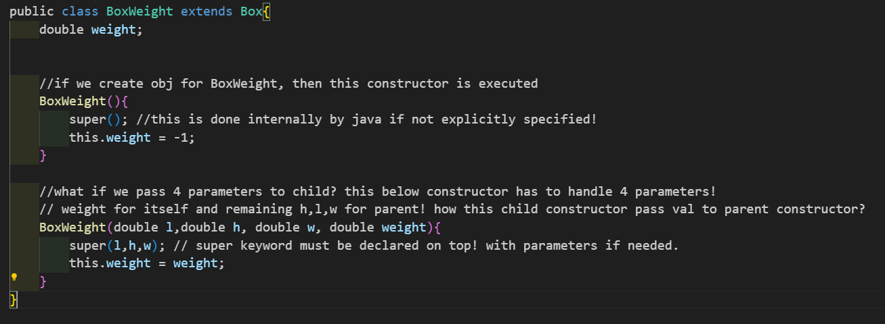
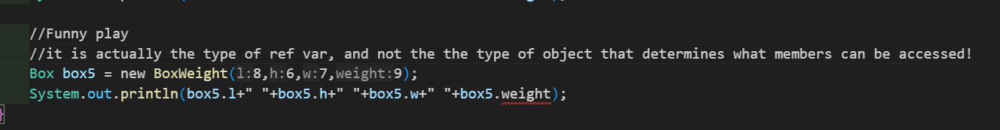

### Properties of OOP:
1. **Inheritance**
2. **Polymorphism**
3. **Encapsulation**
4. **Abstraction**

### 1. Inheritance
- Child class ==inherits properties and methods from parent== class (base class).
- =='**extends**'== keyword is used.
- class child_class **extends** parent_class {}
- **child class** = **properties & methods from parent class** **+** **its own resources.**
- When we create obj for a child class which extends parent class, ==Internally child class constructor implicitly calls 'super()' inside to call parent class constructor!==
- This mechanism ensures ==that the parent class (Box) is fully initialized before the child class== (BoxWeight) starts its own initialization process.
- This behavior is ==crucial for maintaining a proper inheritance hierarchy==, where the base class is always initialized first.
- 
- ==**super()**== => calls parent class constructor!

### Core Note!!!
- 
- Parent referencing a child! here we cant access weight? why? **Reason below!**
- When a ref var to sub class obj is assigned to a super class ref var, you will only access things in super obj!
- Ref var dont know that child class's weight parameter!
- PROBLEM HERE IS WHEN THINGS NOT INITIALIZED!

### Things to be noted!
- Case 1 (Only Parent)
    ```java
    //only parent no issues!
    //parent gets memory
    //ACCESS PARENT CLASS VARS
    Box box = new Box();
    ```

- Case 2 (Only Child)
    ```java
    //only child no issues!
    //child gets memory and using super(), parent also gets memory.
    //ACCESS BOTH CLASS VARS
    BoxWeight box = new BoxWeight();
    ```

- Case 3 (Parent ref & child Obj)
    ```java
    //parent referencing child!
    //Both gets memory, but ref since ref var is of parent type, we can only access parent class vars not the child's vars!
    //This is called upcasting. You cannot directly access the BoxWeight-specific members (like weight) without casting.
    Box box = new BoxWeight();
    ```

- Case 4 (Child ref & parent Obj)
    ```java
    //child referencing parent?
    //A parent (Box) cannot be treated as a child (BoxWeight), as the parent lacks the additional members or behaviors of the child.
    //Compilation Error: "Incompatible types: Box cannot be converted to BoxWeight".
    BoxWeight box = new Box();
    ```

### Thus! (Check Main.java for fun😂😂😂)

| Code                        | Description & Behavior                                    | Valid?   |
|-----------------------------|----------------------------------------------------------|----------|
| `Box box = new Box();`      | Parent object with access to parent members only.         | ✅ Valid |
| `BoxWeight box = new BoxWeight();` | Child object with access to both parent and child members. | ✅ Valid |
| `Box box = new BoxWeight();`| Parent reference to child object; only parent members accessible. | ✅ Valid (upcasting) |
| `BoxWeight box = new Box();`| **Invalid**; parent cannot be assigned to a child reference. | ❌ Invalid |

### Super keywork in Detail
There are 2 usecases!

**The thing is:**
1. ==**Class Object**== is the root of the class hierarchy.
2. Every class has ==**Object**== as a superclass. 
3. That is the reason, ==**when u use 'super()' keyword in parent class constructor, we dont get any error!**==
4. 
    1. We can use this.w (This is parent class var but accessible. Java first checks current instance and then checks inside parent)
    2. We can also use super.w (directly checks parent)
    3. This is mostly helpful when both parent and child has same named var. (we distinguish by 'this' & 'super' keywords!)
 5. Super class has no idea about child class! we cant place it below in constructor of child. ==**it should always be placed first!**==
 6. Must check copy constructor inside BoxWeight! (MANDATORY)
   
### Types of Inheritance
1. ==**Single Inheritance**== - one class extends another class (NOT ALLOWED IN JAVA)
   
2. ==**Multi-level Inheritance**== - A <- B(Child of A, Parent of B) <- C.
   
3. ==**Multiple Inheritance**== - One class extending more than one class
   

    **Problem:**
    
    Here both parents has same var, child gets confused to which one should pick! 
    So that's why java dont allow this multiple inheritance.
    **Solution:**
    Solution to this problem, to replicate this same behaviour we can use Interfaces.
4. ==**Hierarchical Inheritance**== - one class is inherited by many classes.
   
5. ==**Hybrid Inheritance**== - Single + Multiple Inheritance (NOT ALLOWED IN JAVA)
   
   **problem:** Multiple inheritance is not allowed!
   **Solution:** use Interfaces.