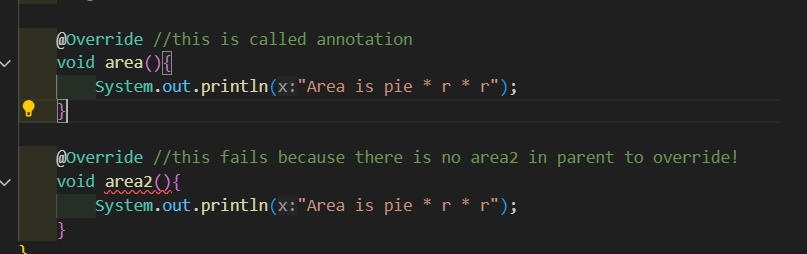
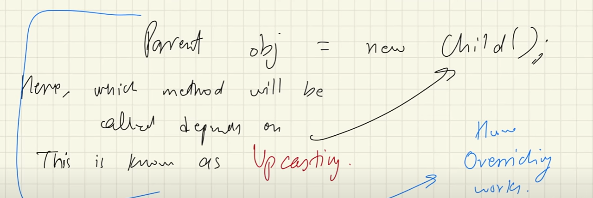

### 2. Polymorphism

1. **Poly** -> ==Many==, **morphism** -> ==ways to represent.==
   
### Types of polymorphism
### 1. ==**Compile time/ Static Polymorphism**==
   * This is done using ==**method overloading.**==
   * Operator overloading also works but java not supports it!
   * **Class has ==multiple methods that has same name==!
      They are differentiated using parameters in it.**
   * Same Func name, But these will be different!
     1. Type
     2. Number of Arguments
     3. Return type
     4. Ordering
   * **Java decides which method or constructor to call during compile time!**

**Example**
1. **Type of Arguments**  
```java
class OverloadingExample {
    void display(int number) {
        System.out.println("Integer: " + number);
    }
    
    void display(String text) {
        System.out.println("String: " + text);
    }
}

public class Main {
    public static void main(String[] args) {
        OverloadingExample obj = new OverloadingExample();
        obj.display(10);  // Calls the method with int parameter
        obj.display("Hello");  // Calls the method with String parameter
    }
}
```
2. **Number of Arguments**  
```java
class OverloadingExample {
    void show(String name) {
        System.out.println("Name: " + name);
    }
    
    void show(String name, int age) {
        System.out.println("Name: " + name + ", Age: " + age);
    }
}

public class Main {
    public static void main(String[] args) {
        OverloadingExample obj = new OverloadingExample();
        obj.show("Alice");  // Calls the method with one parameter
        obj.show("Alice", 25);  // Calls the method with two parameters
    }
}
```
3. **Return Type**  
Note: **Return type alone cannot differentiate overloaded methods**, but it works if combined with other differences (e.g., argument type/number).  
```java
class OverloadingExample {
    void calculate(int a, int b) {
        System.out.println("Sum: " + (a + b));
    }
    
    int calculate(int a, int b, int c) {
        return a + b + c;
    }
}

public class Main {
    public static void main(String[] args) {
        OverloadingExample obj = new OverloadingExample();
        obj.calculate(3, 4);  // Calls the method with two arguments
        int result = obj.calculate(1, 2, 3);  // Calls the method with three arguments
        System.out.println("Sum (3 args): " + result);
    }
}
```
4. **Order of Arguments**  
```java
class OverloadingExample {
    void display(String name, int age) {
        System.out.println("Name: " + name + ", Age: " + age);
    }
    
    void display(int age, String name) {
        System.out.println("Age: " + age + ", Name: " + name);
    }
}

public class Main {
    public static void main(String[] args) {
        OverloadingExample obj = new OverloadingExample();
        obj.display("Alice", 25);  // Calls the method with String, int
        obj.display(25, "Bob");  // Calls the method with int, String
    }
}
```
### Note!
* Obviously the ==**memory for the program is allocated in runtime**== only.
* But which method or which constructor to ==**execute is decided in compile time!**== WHERE WE USE ALL **COMPILE TIME POLYMORPHISM** STUFFS.

### 1. ==**Run time/ Dynamic Polymorphism**==
* Achieved by method overriding **(Late binding).**
* child and parent has exact same method!
* Check our shapes example!
  ```java
   public class Shapes{
         // Parent has area method with void return type!
         void area(){
            System.out.println("I am in Shapes");
         }
      }
   ```
* child class extends this parent(example consider circle)
   ```java
   public class Circle extends Shapes{
      void area(){
         System.out.println("Area is pie * r * r");
      }
   }
   ```
* here circle also has exact same method signature but differs by body!
* Here inside cicle  this area method overrides the parent's area methdo!, when we create obj for circle and call area, child's area method will be called not the parent's area method!.
* We use "@override" annotation to represent it.

### Note!
1. 
   Here the second @override fails because there is no area2 method inside the parent class to override!

   **Error**
   ```java
   Circle.java:12: error: method does not override or implement a method from a supertype
      @Override //this fails because there is no area2 in parent to override!
      ^
   1 error
   ```

2. What if ==**ref type is parent and obj is of sub class?**==
   Ref type is of super class, but which method to call? depends on obj class we used!

   
   * How java determines this, which method to run?
   * Ref var => ==Determines which to access==
   * Obj => ==Determines which to run==
   * Now which method to run? parent's(ref var) or child's(obj)?
   **HERE IS WHAT JAVA DOES!**
   * **==Dynamic Method Dispatch==**
   * A Mechanism in which a **call to an overridden method is resolved at runtime** rather than compile time!

   PLEASE CHECK **ObjectPrint.java** inside Examples folder!
   All done at runtime!

3. We can use final keyword to prevent overriding!
   * **We cannot override a method when it is declared as final.**
   * This is checked in compile time itself => **"Early binding"**

   overall,
   * ==**normal method overriding**== => Late binding (done at runtime)
   * ==**final method overriding**== => Early binding (dont at compile time itself after java encounters final keyword!)

   * **We can also declare a class as final to prevent inheritance!**
   * **All the methods are also inplicitly final too!**
   * ==**Static methods are special here! do u think they can be overridden??**==😂 The method in parent will always gets executed in this case! if both same methods are declared as static in both parent and child!
   * ==**static methods cannot be overridden from child**== (Not possible!). 
   
   Overall,
   * static methods can be inherited, but cannot be overridden!
   * parent class's static method is not dependent on any child obj! so wherever you call, method in parent will get executed, not from child!
   * **It considers static method in parent, not from child. Also we cannot use @Override for static method in child(THIS FAILS!)**
    
   Final Conclusion!
   * ==**OVERRIDE DEPENDS ON OBJ, STATIC DOESNT DEPEND ON OBJ! SO WE CANNOT OVERRIDE OBJ! STATIC DOES NOT DEALS WITH OBJECTS!**==

   * Both overloading and overriding cannot be applicable to instance variables!
   * ```java
      //Instance Variables Cannot Be Overloaded
      public class Example {
         int value;
         String value; // ERROR: Duplicate field 'value'
      }
      //You cannot declare two instance variables with the same name in the same class, even with different types or modifiers. This will result in a compile-time error.

      ```

   * ```java
      class Parent {
         int value = 10;
      }

      class Child extends Parent {
         int value = 20; // Hides the parent's 'value'
      }

      public class Main {
         public static void main(String[] args) {
            Parent obj = new Child();
            System.out.println(obj.value); // Outputs: 10 (Parent's variable)
         }
      }

      ```

   * In this example, value in the Child class does not override value in the Parent class. Instead, the Parent's variable is accessed because the reference type is Parent.

   * If a subclass declares a variable with the same name as a variable in its superclass, **this does not override the superclass variable. Instead, it hides the variable. This is known as variable shadowing.**
   * The superclass and subclass variables are treated as separate entities, and the **variable accessed depends on the Ref var.**
   * Polymorphism is not applicable for instance vars.