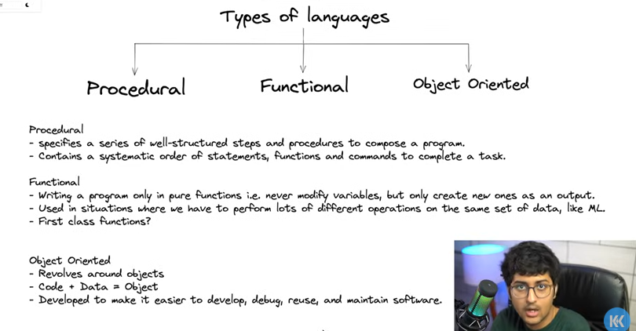
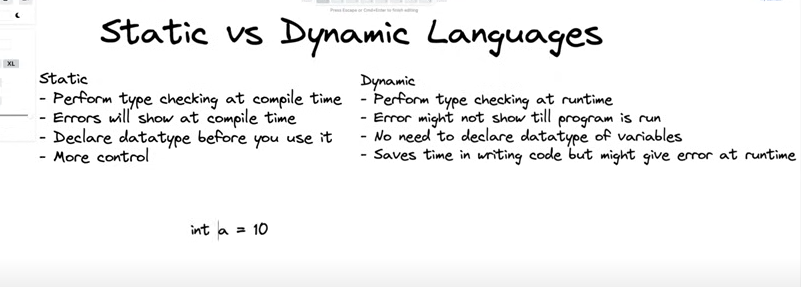

Programming languages can be categorized into different types based on their paradigms (styles of programming). Here are some common types:  



### 1. **Procedural Languages**  
   - Follow step-by-step instructions (procedures) to solve a problem.  
   - Use functions or procedures to structure code.  
   - Examples: C, Pascal, Fortran, BASIC

### 2. **Object-Oriented Languages (OOP)**  
   - Use objects and classes to organize code.  
   - Follow principles like encapsulation, inheritance, and polymorphism.  
   - Examples: Java, C++, Python (supports OOP), C#  

### 3. **Functional Languages**  
   - Focus on pure functions and immutability.  
   - Avoid changing state or modifying variables.  
   - Examples: Haskell, Lisp ,Scala, Elixir  

### 4. **Scripting Languages**  
   - Used for automation, web development, and scripting tasks.  
   - Often interpreted rather than compiled.  
   - Examples: JavaScript, Python, PHP, Ruby  

### 5. **Logic Programming Languages**  
   - Based on formal logic and rule-based programming.  
   - Used in AI and problem-solving.  
   - Examples: Prolog, Datalog  

### 6. **Markup Languages (Not Programming Languages but Used for Structuring Data)**  
   - Define document structure and presentation.  
   - Examples: HTML, XML

### Static vs Dynamic languages:  


The difference between **static** and **dynamic** typed languages mainly affects **how variables are declared and how type checking is done**. Here’s a breakdown:

### **1. Static Typed Languages**  
- **Type checking happens at compile time.**  
- You must declare the variable's data type before using it.  
- If there is a type mismatch, the error is caught before running the program.  
- More strict but helps avoid runtime errors.  

#### **Example (C, Java, C++):**  
```c
int a = 10;  // 'a' is explicitly declared as an integer
a = "hello";  // ❌ Compilation Error: Type mismatch
```

### **2. Dynamic Typed Languages**  
- **Type checking happens at runtime.**  
- You do not need to declare the variable's type; the interpreter assigns it dynamically.  
- More flexible but can lead to runtime errors if not handled properly.  

#### **Example (Python, JavaScript, Ruby):**  
```python
a = 10   # 'a' is an integer now
a = "hello"  # No error, 'a' is now a string
```

### **Key Differences in Variable Declaration**  
| Feature        | Static Typed Language | Dynamic Typed Language |
|---------------|----------------------|----------------------|
| **Type Checking** | Compile-time | Runtime |
| **Variable Declaration** | Explicitly mention type | No need to mention type |
| **Error Detection** | Before execution | During execution |
| **Flexibility** | Less flexible | More flexible |
| **Example Languages** | C, Java, C++ | Python, JavaScript, Ruby |

### Memory Types
1. Static memory
2. Heap memory
3. 